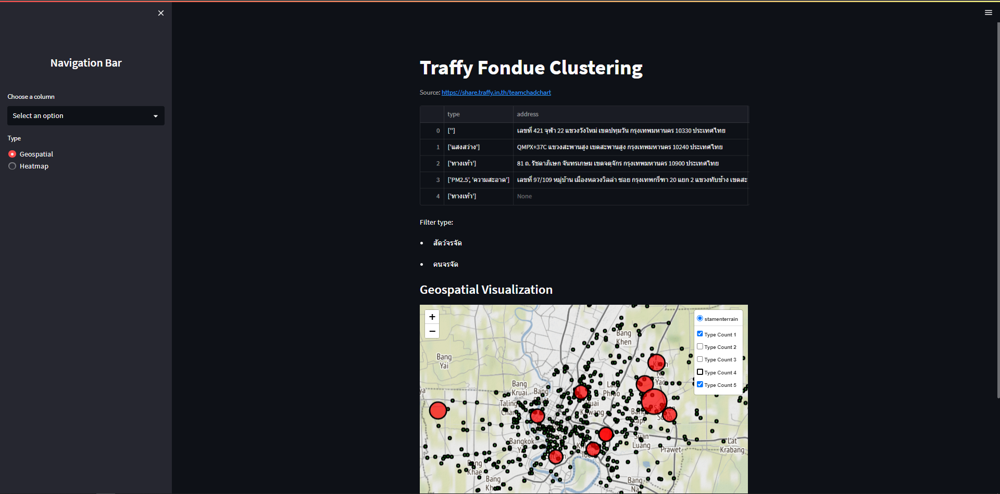

# Traffy Fondue Clustering Project

__Created by__  

- 6330440921 Bhuribhat Ratanasanguanvongs
- 6330301321 Panithi Khamwangyang
- 6330305921 Pras Pitasawad

## Description

This project is the final project for the Data Science and Data Engineering course. The goal of this project is to apply clustering techniques to the Traffic Fondue dataset to uncover interesting insights in Thailand.  

We will be using Python and popular data science libraries such as Pandas, Scikit-Learn, Folium, and Matplotlib to preprocess the data, perform the clustering analysis, and visualize the results.  

Once we have identified the clusters, we will use visualization techniques to explore the relationships between the clusters. The goal is to uncover interesting patterns and insights about traffic in Thailand that could be used to inform policy decisions.  

By the end of this project, we will have gained experience in applying clustering techniques to real-world datasets, using data visualization tools to communicate insights effectively, and working with common data science libraries in Python. We hope that our findings will contribute to a better understanding of low-income area in Thailand and inspire further research in this area.


## Initializing Environment

If you are using linux os, please follow the following steps:

```bash
>> mkdir ./dags ./logs ./plugins
>> echo -e  "AIRFLOW_UID=$(id -u)\nAIRFLOW_GID=0" > .env
```

> Note: For other operating systems, you may get a warning that __AIRFLOW_UID__ is not set, but you can safely ignore it. You can also manually create an __.env__ file in the same folder as __docker-compose.yaml__ with this content to get rid of the warning:  

```bash
AIRFLOW_UID=50000
```

- __./dags__    - you can put your DAG files here.
- __./logs__    - contains logs from task execution and scheduler.
- __./plugins__ - you can put your [custom plugins](https://airflow.apache.org/docs/apache-airflow/stable/authoring-and-scheduling/plugins.html) here.


## Run Airflow

```bash
>> docker-compose up airflow-init   # run database and create first user account
>> docker-compose up -d             # run container in background
```

Run `docker ps` to check the condition of the containers and make sure that no containers are in unhealthy condition:

```bash
>> docker ps
CONTAINER ID   IMAGE                  COMMAND                  CREATED          STATUS                    PORTS                              NAMES
247ebe6cf87a   apache/airflow:2.6.0   "/usr/bin/dumb-init …"   3 minutes ago    Up 3 minutes (healthy)    8080/tcp                           compose_airflow-worker_1
ed9b09fc84b1   apache/airflow:2.6.0   "/usr/bin/dumb-init …"   3 minutes ago    Up 3 minutes (healthy)    8080/tcp                           compose_airflow-scheduler_1
7cb1fb603a98   apache/airflow:2.6.0   "/usr/bin/dumb-init …"   3 minutes ago    Up 3 minutes (healthy)    0.0.0.0:8080->8080/tcp             compose_airflow-webserver_1
74f3bbe506eb   postgres:13            "docker-entrypoint.s…"   18 minutes ago   Up 17 minutes (healthy)   5432/tcp                           compose_postgres_1
```

Run airflow DAG with parameters in `json` format for the tasks:

> Example: --conf '{"filter":["ถนน","ทางเท้า"]}' or Trigger DAG w/ config in UI to filter data  

```bash
>> airflow trigger_dag 'dag_name' -r 'run_id' --conf '{"key":"value"}'
```

## Open Airflow UI

The webserver is available at: `http://localhost:8080`  
The default account has the login __airflow__ and the password __airflow__.  

<p align="left">
    
</p>


## Close Airflow Docker

```bash
>> docker-compose down -v
```


## MLflow UI

The webserver is available at: `http://localhost:6543`  

```bash
>> mlflow ui --port 6543
```

Create a REST API locally with MLflow serving:  

```bash
>> mlflow models serve --model-url runs:/run_id/model --port 1244
```


<p align="left">
    
</p>


## Interactive Dashboard

The webserver is available at: `http://localhost:8501`  

```bash
>> streamlit run streamlit_app.py
```

<p align="left">
    
    
</p>


## Interesting Insight

- low-income heatmap  
- filter: ["ความสะอาด"] via postman

<p align="left">
    
</p>
